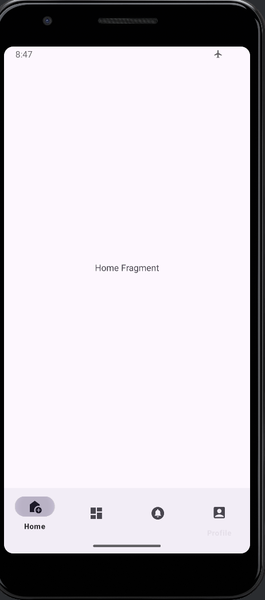
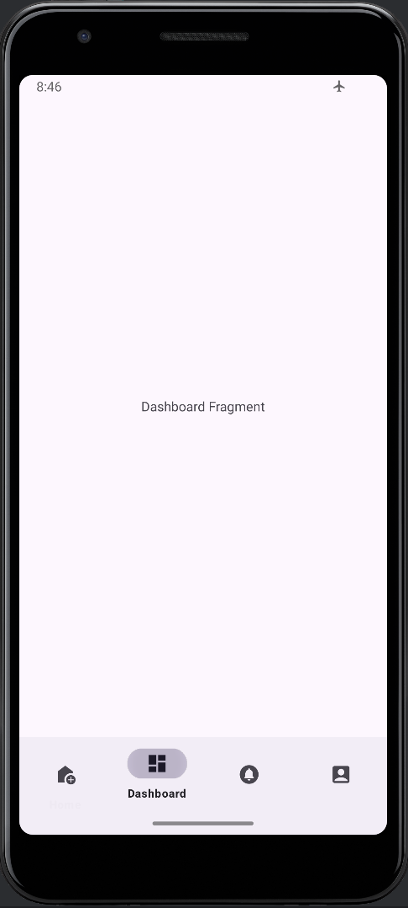
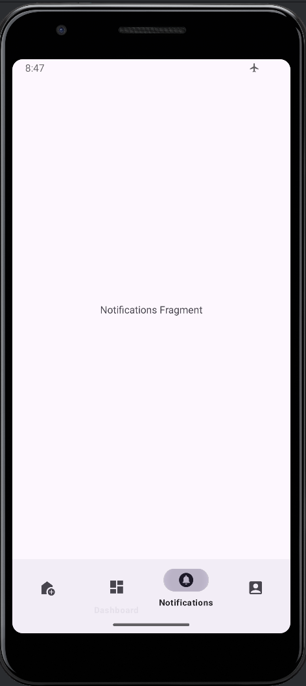
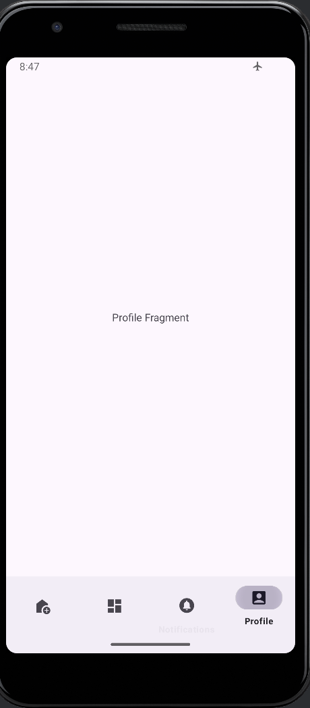
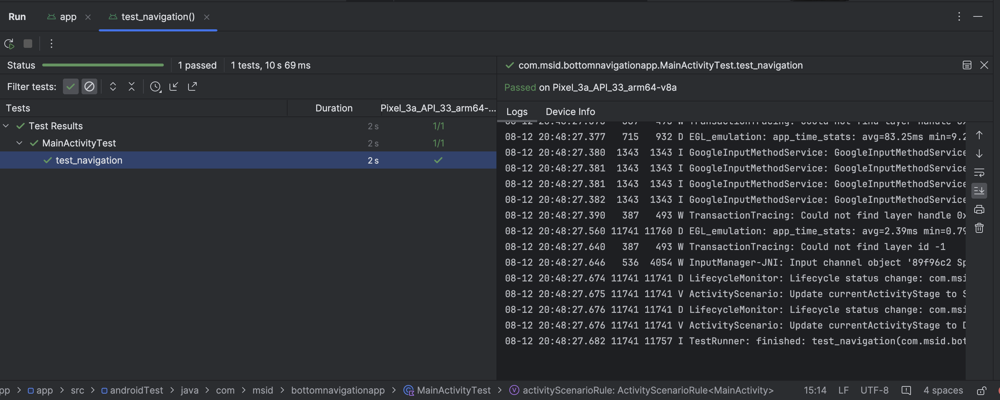

# Created test cases for Bottom Navigation 
```
class MainActivityTest{

    @get:Rule

    var activityScenarioRule:ActivityScenarioRule<MainActivity> = ActivityScenarioRule(MainActivity::class.java)

    @Test
    fun test_navigation(){
        // Navigate to DashBoard
        onView(withId(R.id.nav_dashboard)).perform(click())
        onView(withId(R.id.text_dashboard)).check(matches(isDisplayed()))

        // Navigate to Notifications
        onView(withId(R.id.nav_notifications)).perform(click())
        onView(withId(R.id.text_notifications)).check(matches(isDisplayed()))

        // Navigate to Profile
        onView(withId(R.id.nav_profile)).perform(click())
        onView(withId(R.id.text_profile)).check(matches(isDisplayed()))

        // Navigate to Home
        onView(withId(R.id.nav_home)).perform(click())
        onView(withId(R.id.text_home)).check(matches(isDisplayed()))
    }
}
```

## Screenshots

   <  



